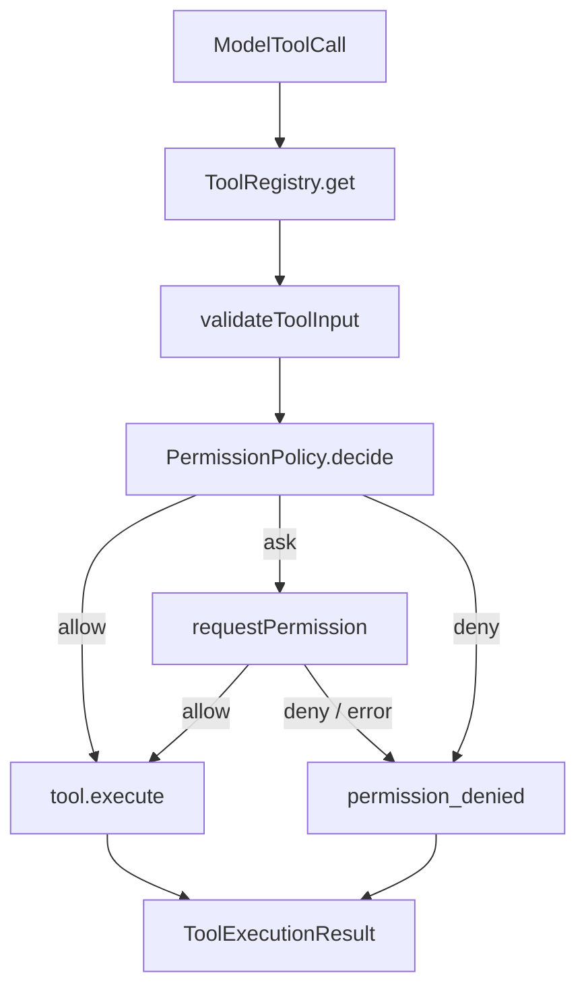

# 第 06 章：Permission（权限系统）

## 本章目标

读完本章，你应该能理解：

- `allow`、`deny`、`ask` 三类权限决策的含义。
- 权限判断为什么必须发生在输入校验之后、工具执行之前。
- mini-ccode 当前权限模型与 ccb 的差异。

## 模块定位

Permission 是工具执行前的授权层。

它不直接执行工具，也不负责显示确认弹窗。它只回答一个问题：

```text
这一次工具调用能不能执行？
```

在 mini-ccode 中，它位于：

```text
ToolCall -> validate input -> PermissionPolicy -> tool.execute
```

## 最小模型

Permission 的最小模型只有三个决策：

| 决策 | 含义 | 执行器动作 |
|---|---|---|
| `allow` | 允许执行 | 调用工具 |
| `deny` | 拒绝执行 | 不调用工具，返回 `permission_denied` |
| `ask` | 需要确认 | 如果 CLI 提供审批入口，则等待用户回答；否则保守拒绝 |

`ask` 的关键点是“策略不直接决定最终执行”，而是把决定交给上层审批入口。当前默认 CLI 已经实现逐次审批；如果某个调用方没有提供审批函数，执行器会按“失败时关闭”（fail-closed）原则保守拒绝。

## 执行顺序

Permission 必须在输入校验之后、工具执行之前。



这个顺序固定下来后，后续 File Tools 和 Bash 都不能绕过权限层。

## 本项目中的实现

Permission public API 在 `src/permission/`：

```text
src/permission/
  types.ts
  policies.ts
  index.ts
```

核心类型：

```ts
type PermissionDecision =
  | { behavior: "allow"; reason?: string }
  | { behavior: "deny"; reason: string }
  | { behavior: "ask"; reason: string };

type PermissionPolicy = {
  decide(request: PermissionRequest): PermissionDecision | Promise<PermissionDecision>;
};
```

执行入口在 `src/tools/execute.ts`。`executeToolCall()` 会：

```text
1. 找工具
2. 校验参数
3. 调 permission policy
4. allow 才执行工具
5. ask 交给审批入口；没有审批入口或用户拒绝时返回结构化错误
```

## 内置策略

### allowAllPermissionPolicy

全部允许策略，允许所有工具。

用途是让显式选择 `--permission-mode allow-all` 的 CLI 用户执行现有写入工具，也供内部调用方在明确范围内选择。`executeToolCall()` 没有传入策略时仍使用它作为底层兼容默认值；真实 CLI 路径已经显式注入策略，默认采用只读模式。

### readOnlyPermissionPolicy

只允许 `tool.isReadOnly === true` 的工具。

这是当前最接近安全边界的教学策略：它不懂路径、不懂 Bash 命令，但能证明非只读工具不会执行。

### createToolNamePermissionPolicy

按工具名或 alias 判断。

匹配顺序：

```text
deny > ask > allow > defaultDecision
```

deny 优先，避免配置冲突时误放行。

## 教学版取舍

| 维度 | ccb 做法 | mini-ccode 当前实现 |
|---|---|---|
| 权限模式 | default、plan、acceptEdits、dontAsk、bypassPermissions、auto | CLI 支持 `read-only` / `allow-all` 两档，内部使用 policy |
| 规则来源 | session、user、project、local、policy、cliArg | 内存策略 |
| 工具级判断 | 工具有 `checkPermissions()` | 工具没有权限方法，统一交给 policy |
| `ask` 处理 | React/Ink permission prompt | CLI 文本审批；无审批入口时保守拒绝 |
| 内容级规则 | Bash 命令、路径、MCP server、hooks、classifier | 内置策略只看工具名和只读标记 |
| 执行器 | streaming tool executor + hooks + telemetry | `executeToolCall()` 串行执行 |

mini-ccode 当前复刻的是 ccb 的权限边界，不是 ccb 的完整权限系统。

## 关键代码导读

| 文件 | 作用 |
|---|---|
| `src/permission/types.ts` | 定义 `PermissionDecision`、`PermissionPolicy`、`PermissionRequest` |
| `src/permission/policies.ts` | 实现 allow-all、read-only、tool-name policy |
| `src/tools/types.ts` | `ToolExecutionContext` 增加 `permissionPolicy`，错误码增加 `permission_denied` |
| `src/tools/execute.ts` | 在 validate 后、execute 前执行权限判断 |
| `src/agent/agent.ts` | 把 Agent 选项里的 permission policy 传给工具执行器 |
| `src/cli/options.ts` | 将用户选择的 CLI 权限模式转换成 permission policy |
| `src/cli/run.ts` | 默认使用只读模式，并把策略注入真实 CLI Agent |

## 测试覆盖

当前测试覆盖四层：

| 测试 | 覆盖点 |
|---|---|
| `tests/permission.test.ts` | policy 自身行为 |
| `tests/tool-system.test.ts` | `executeToolCall()` 权限门控和失败时关闭（fail-closed） |
| `tests/agent-loop.test.ts` | Agent Loop 消费 permission denied tool result |
| `tests/agent-loop-golden.test.ts` | 权限拒绝进入完整 transcript |
| `tests/cli-render.test.ts` | CLI 把权限拒绝渲染为 tool error |
| `tests/cli-options.test.ts` | CLI 模式解析和策略转换 |
| `tests/cli-run.test.ts` | 默认写入被拒绝、显式允许后文件确实被修改 |

## 常见误区

### 把 Permission 写成 boolean

`true / false` 不够。系统需要表达：

```text
allow
deny
ask
```

还需要 reason 写回模型和用户界面。

### 参数错误也进入权限确认

参数错误不是权限问题。顺序必须是：

```text
validate input -> permission decision
```

### 工具自己绕过权限系统

File Tools 已通过 Tool System 和 Permission 执行本地副作用；未来 Bash 也必须复用同一条链路。

### ask 等同于 deny

语义上 `ask` 是“需要确认”，不是永久拒绝。只有在没有审批入口、用户拒绝或审批函数失败时，它才会落到 `permission_denied`。

## 后续扩展

后续模块可以沿着当前边界扩展：

| 后续能力 | 接入方式 |
|---|---|
| CLI 逐次审批界面 | 把 `ask` 交给 CLI 询问用户 |
| File Tools 增强 | policy 增加路径级规则和写前检查 |
| Bash | policy 检查命令分类和危险模式 |
| Session / Settings | 持久化 allow / deny / ask 规则 |
| Hooks | 在 permission 前后插入用户配置的检查 |
| MCP / Plugin | 给外部工具增加 server 级规则 |

当前实现的价值是：这些能力以后都有同一个执行入口，不需要各自发明权限系统。
