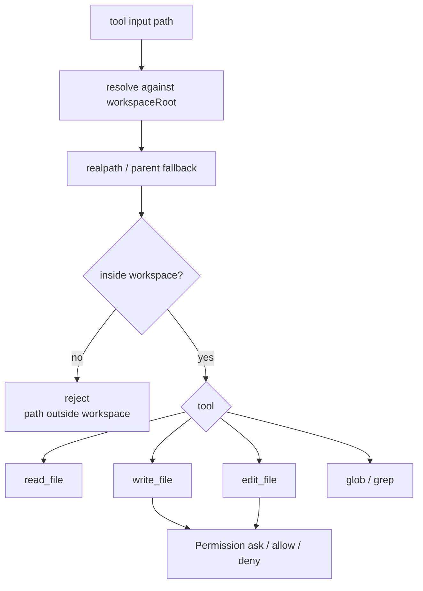

# 第 08 章：File Tools（文件工具）

## 本章目标

读完本章，你应该能理解：

- 编程 Agent 为什么必须能读取、搜索和修改真实文件。
- 文件工具如何通过工作区边界防止越界访问。
- 文件副作用如何经过 Tool System 和 Permission。

## 文件工具边界图

文件工具的第一条边界是工作区根目录。所有路径都要先解析成真实路径，再确认没有越过 `workspaceRoot`。



## 这个模块解决什么问题

File Tools 让 Agent 第一次能观察和修改真实工作区文件。

前面的 Tool System 已经解决“工具如何注册、校验、执行”，Permission 已经解决“工具执行前如何被策略拦截”，Provider Tool Calls 已经解决“真实模型如何发工具调用”。但如果没有 File Tools，模型仍然没有真正的 coding 能力，只能调用测试里的假工具。

本模块提供五个最小文件工具：

```text
read_file
write_file
edit_file
glob
grep
```

它们都通过现有 Tool System 和 Permission 执行，不绕过工具执行链路。

## 编程 Agent 工具为什么需要它

编程 Agent 工具的核心不是“回答问题”，而是围绕代码仓库循环：

```text
查找文件 -> 读取文件 -> 理解内容 -> 修改文件 -> 再检查结果
```

File Tools 就是这个循环的第一组真实动作。

第一版不追求生产级完整能力，而是先把最小闭环跑通：

```text
ModelToolCall
  -> ToolRegistry
  -> executeToolCall()
  -> PermissionPolicy
  -> File Tool
  -> ToolExecutionResult
  -> Agent Loop 下一轮消息
```

## 最小实现

最小可用版本需要三类能力。

第一，统一路径边界：

```text
用户传入路径
  -> 按 workspaceRoot 解析
  -> realpath 检查真实路径
  -> 确认没有越过工作区
```

这样工具不会随意读写工作区外的文件。

第二，读写编辑工具：

```text
read_file  -> 返回带行号文本
write_file -> 写入完整 UTF-8 文本
edit_file  -> 用 old_string 唯一替换一次
```

第三，搜索工具：

```text
glob -> 按路径模式找文件
grep -> 按正则找文本行
```

搜索第一版用 Node 标准库递归遍历，跳过 `.git`、`node_modules`、`dist` 等噪声目录，结果排序保证测试确定。

## 本项目中的实现

文件布局：

| 文件 | 作用 |
|---|---|
| `src/file-tools/index.ts` | 聚合导出 `createFileTools()` |
| `src/file-tools/path.ts` | 工作区路径解析和越界检查 |
| `src/file-tools/read.ts` | `read_file` |
| `src/file-tools/write.ts` | `write_file` |
| `src/file-tools/edit.ts` | `edit_file` |
| `src/file-tools/search.ts` | `glob` 和 `grep` |
| `src/file-tools/diff.ts` | 精简统一差异（compact unified diff） |

公开入口是：

```ts
createFileTools({ workspaceRoot })
```

调用方把返回的工具注册到 `ToolRegistry`：

```ts
const tools = new ToolRegistry(createFileTools({ workspaceRoot }));
```

之后 Agent Loop 就能像消费任何工具一样消费文件工具。

## 阶段性体现

本阶段已经能通过最近消费者观察到真实文件工具：

```text
executeToolCall(read_file)
executeToolCall(write_file)
executeToolCall(edit_file)
executeToolCall(glob)
executeToolCall(grep)
Agent Loop -> read_file -> tool result -> 下一轮模型请求
Permission -> 拒绝 write_file / edit_file -> 磁盘不变
```

这说明 File Tools 不是孤立 API。它已经接入 Tool System、Permission 和 Agent Loop。

CLI 默认 Agent 已经注册真实 File Tools。也就是说，真实模型协议、文件工具、Agent Loop 和 CLI 用户路径已经连通。用户在 `bun run mini-ccode` 中提出文件相关请求时，模型可以看到 `read_file`、`glob`、`grep` 等工具，并通过工具调用让 Agent 执行它们。

CLI 权限入口完成后，默认会话使用 `default` 模式：读取和搜索可以直接执行，写入和编辑会先询问用户。用户也可以显式选择更保守或更宽松的模式：

```text
bun run mini-ccode -- --permission-mode read-only "只检查，不修改"
bun run mini-ccode -- --permission-mode allow-all "允许模型直接修改指定文件"
```

需要注意当前工具循环上限：CLI 没有额外配置 `maxTurns`，所以使用 Agent 默认值 `maxTurns = 50`。这个值不是能力承诺，而是防止无限循环的轮次预算：它允许较完整的多步文件任务继续推进，同时给失控工具循环留出明确边界。

```text
用户请求
  -> 模型发出 tool_calls
  -> Agent 执行工具
  -> 模型根据工具结果回答或继续请求工具
  -> 最多 50 轮
```

如果模型超过 50 轮仍继续请求工具，会触发 `max_turns`。后续 CLI / REPL 可以增加 `--max-turns`，让用户按任务复杂度调整。

## 教学版取舍

| 维度 | ccb 做法 | mini-ccode 当前阶段 |
|---|---|---|
| Read | 支持更多文件类型、词元限制、读取状态 | 只读 UTF-8 文本，返回行号 |
| Write | 有读前写、修改时间保护、历史记录 | 直接完整写入工作区内文件 |
| Edit | 支持更复杂的替换、格式处理和补丁展示 | 只做唯一 `old_string` 替换 |
| Search | 通常依赖更强搜索能力和忽略规则 | Node 标准库递归遍历 |
| Permission | 有交互式权限确认 | 默认模式逐次询问；也支持只读和全部允许 |
| Tool UI | 有丰富渲染和结果管理 | 当前只产生工具结果文本 |

这些简化是有意的：第一版先证明真实文件副作用能安全进入 Agent Loop，而不是一开始复制生产工具的全部复杂度。

## 关键代码导读

`resolveWorkspacePath()` 是安全边界。它使用真实路径检查，防止路径越过 `workspaceRoot`。

`read_file` 返回带行号文本，这让模型后续能引用具体位置。

`write_file` 和 `edit_file` 都是非只读工具。只读策略（read-only policy）会在工具执行前拒绝它们，所以测试能证明磁盘不会被修改。

`glob` 和 `grep` 都按相对路径排序，保证同一组文件在不同机器上也有稳定输出。

## 常见误区

- 直接在工具里做权限判断。权限应该由 Tool System 统一调用 `PermissionPolicy`。
- 允许工具读写任意绝对路径。所有路径都必须经过工作区边界检查。
- 搜索结果不排序。文件系统遍历顺序不稳定，会让测试和模型上下文不稳定。
- 把 `old_string` 多次出现时也直接替换。这样模型很容易改错位置。
- 把业务可恢复错误都抛异常。比如 `old_string not found` 应该作为工具结果给模型观察。

## 可扩展方向

当前端到端路径已经成立：

```text
bun run mini-ccode -- --permission-mode read-only
用户：读取 package.json
模型：tool_calls read_file
Agent：执行 read_file
CLI：显示工具调用和结果
模型：继续回答
```

需要文件修改的闭环则是：

```text
bun run mini-ccode -- --permission-mode allow-all "修改 package.json"
模型：tool_calls edit_file
Agent：执行权限检查并允许编辑
CLI：显示工具调用和结果
```

之后可以继续加：

- 读前写约束和修改时间保护（mtime guard）
- 文件历史和撤销
- 更成熟的 diff 库
- ripgrep 搜索
- 权限审批 UI
- 大文件读取和工具结果压缩
