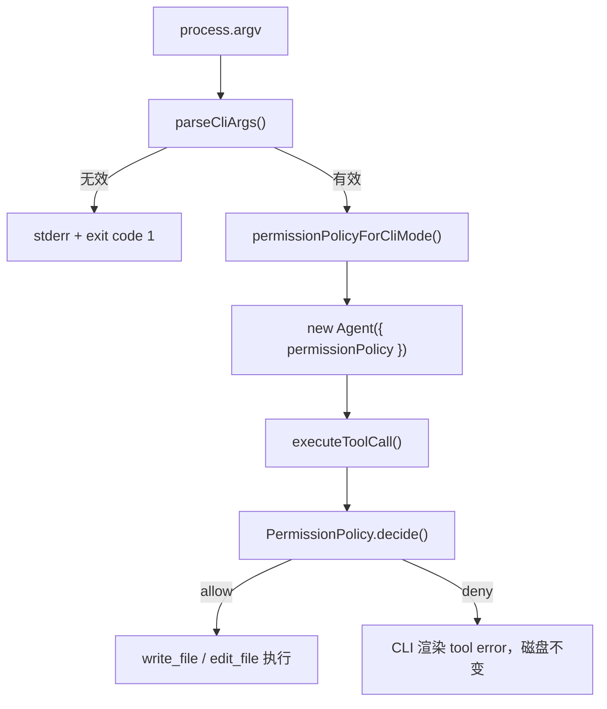

# CLI 权限模式入口教学文档

> 本文记录第 09 阶段建立启动权限模式入口时的实现。第 11 阶段“交互式权限审批”已经在此基础上加入默认（`default`）询问模式；当前用户行为请结合 `docs/11-interactive-permission-approval.md` 阅读。

## 这个模块解决什么问题

权限策略写在代码里，并不等于用户真的拥有权限控制。

在本模块之前，mini-ccode 已经有只读策略和全部允许策略，测试也能证明只读策略可以阻止写文件。但 CLI 默认创建 Agent 时没有选择策略的入口，因此用户启动程序后，模型请求 `write_file` 或 `edit_file` 会按全部允许行为执行。

本模块把权限选择接到了用户实际启动路径：

```text
用户指定权限模式
  -> CLI 转换成 PermissionPolicy
  -> Agent 执行文件工具前咨询该策略
  -> 用户选择真实影响磁盘副作用
```

## 为什么这一层必须在 Bash 之前完成

文件写入已经是副作用，Shell 命令的影响范围更大。如果没有用户可操作的权限入口就继续加入 Bash，程序会把更多危险能力暴露在同一个隐式全部允许路径中。

因此模块顺序是：

```text
File Tools
  -> CLI Permission Mode
  -> Bash
```

每一步都有可观察结果：File Tools 让模型能调用真实文件工具；CLI Permission Mode 让用户决定写入是否可以发生；Bash 后续才能复用这条权限路径。

## 最小实现

mini-ccode 当前还没有“执行前暂停并向用户提问”的界面。因此第一版只提供两个语义准确的模式：

| CLI 模式 | 对应策略 | 行为 |
|---|---|---|
| `read-only` | 只读策略（`readOnlyPermissionPolicy()`） | 允许读取和搜索，拒绝写入和编辑 |
| `allow-all` | 全部允许策略（`allowAllPermissionPolicy()`） | 允许现有文件工具执行，包括写入和编辑 |

未指定模式时使用 `read-only`：

```text
bun run mini-ccode -- "检查代码结构"
```

需要修改文件时，用户必须显式选择：

```text
bun run mini-ccode -- --permission-mode allow-all "修改 README"
```

这里的默认只读不是在复制 ccb 的完整默认模式，而是在 mini-ccode 尚未实现确认界面的阶段，给出边界清晰且能真实兑现的安全默认值。

## 执行链路

新增的核心链路位于 CLI 外围，不需要改变 File Tools：



CLI 在创建 provider 之前校验参数。这样输入错误不会消耗模型请求，也不依赖 API key。

## 本项目中的实现

| 文件 | 作用 |
|---|---|
| `src/cli/options.ts` | 定义 `CliPermissionMode`，解析 `--permission-mode`，把模式转换成策略 |
| `src/cli/run.ts` | 在创建默认 Agent 时注入所选策略，并在 REPL 显示当前模式 |
| `src/permission/policies.ts` | 复用既有只读与全部允许策略 |
| `tests/cli-options.test.ts` | 证明参数解析和模式到策略的转换 |
| `tests/cli-run.test.ts` | 证明真实 CLI 路径会阻止或允许文件写入 |

测试关注的是磁盘最终状态，而不只是对象有没有被传入：

```text
默认启动 + 模型调用 write_file
  -> CLI 显示权限拒绝
  -> 文件仍是原内容

--permission-mode allow-all + 模型调用 write_file
  -> 工具执行成功
  -> 文件变为新内容
```

这使权限入口成为用户能用到的能力，而不是只有内部调用者才能配置的接口。

## 教学版取舍

| 维度 | ccb 做法 | mini-ccode 当前实现 | 后续补充 |
|---|---|---|---|
| 启动入口 | 支持 `--permission-mode` | 支持 `--permission-mode read-only/allow-all` | 扩充模式语义 |
| 默认模式 | 敏感操作可以进入确认界面 | 默认只读，写入直接拒绝 | 增加确认界面后引入询问模式 |
| 会话中调整 | `/permissions` 等交互入口 | 启动后固定策略 | 增加运行时切换 |
| 规则来源 | 用户、项目、策略、会话等多来源 | 无持久化规则 | Settings / Session 接入 |
| 安全判断 | 文件、Shell、插件等统一决策 | 目前覆盖真实 File Tools | Bash 等模块复用入口 |

ccb 的日常体验更灵活，因为它能在需要写入时询问用户。mini-ccode 当前不具备这项机制，因此选择更保守的默认值，并把完全允许写入变成显式选择。

## 常见误区

- 认为内部存在 `PermissionPolicy` 就代表用户已经获得权限控制。必须接到真实启动路径。
- 在没有确认界面的情况下默认放行，再把它描述为“默认模式”。行为名称必须和实际安全边界一致。
- 为了开发 Bash 临时绕开文件工具已经使用的权限入口。新工具必须复用同一执行链。
- 只测试策略函数，不测试最终文件是否变化。权限功能必须验证副作用是否真的被阻止。

## 可扩展方向

下一步可以设计交互式审批入口，让需要写入的请求暂停并由用户决定“允许一次、始终允许或拒绝”。届时可增加更接近 ccb 的询问模式，而不是让用户在启动时二选一。

在此基础上，Bash 模块可以把命令执行纳入相同权限模式，并进一步设计命令分类、路径限制和执行隔离。
