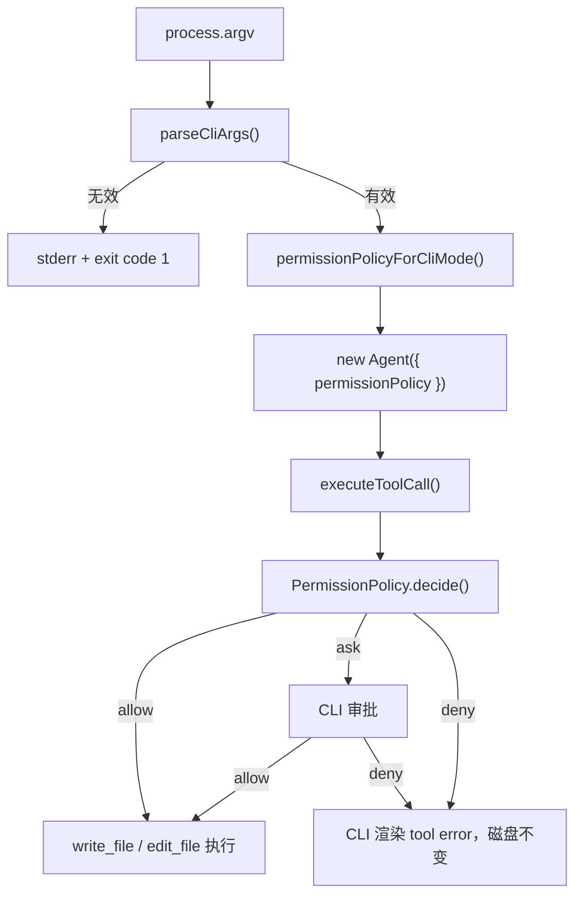

# 第 09 章：CLI 权限模式入口

## 本章目标

读完本章，你应该能理解：

- 为什么权限策略必须接到真实 CLI 启动路径。
- `default`、`read-only` 和 `allow-all` 三种启动模式的边界。
- 为什么这个模块要排在 Bash 命令工具之前。

> 第 09 章先讲权限模式如何接到 CLI。第 11 章会继续说明 `default` 模式里的逐次审批界面。

## 这个模块解决什么问题

权限策略写在代码里，并不等于用户真的拥有权限控制。

在本模块之前，mini-ccode 已经有只读策略、交互策略和全部允许策略，测试也能证明策略本身会影响工具执行。但如果 CLI 默认创建 Agent 时没有选择策略的入口，用户就无法从启动命令决定副作用边界。

本模块把权限选择接到了用户实际启动路径：

```text
用户指定权限模式
  -> CLI 转换成 PermissionPolicy
  -> Agent 执行文件工具前咨询该策略
  -> 用户选择真实影响磁盘副作用
```

## 为什么这一层必须在 Bash 之前完成

文件写入已经是副作用，Shell 命令的影响范围更大。如果没有用户可操作的权限入口就继续加入 Bash，程序会把更多危险能力暴露在同一个隐式全部允许路径中。

因此模块顺序是：

```text
File Tools
  -> CLI Permission Mode
  -> Bash
```

每一步都有可观察结果：File Tools 让模型能调用真实文件工具；CLI Permission Mode 让用户决定写入是否可以发生；Bash 后续才能复用这条权限路径。

## 最小实现

当前 CLI 提供三个模式：

| CLI 模式 | 对应策略 | 行为 |
|---|---|---|
| `default` | 交互策略（`interactivePermissionPolicy()`） | 读取和搜索直接执行；写入、编辑和命令执行前询问 |
| `read-only` | 只读策略（`readOnlyPermissionPolicy()`） | 允许读取和搜索，拒绝写入和编辑 |
| `allow-all` | 全部允许策略（`allowAllPermissionPolicy()`） | 允许现有文件工具执行，包括写入和编辑 |

未指定模式时使用 `default`：

```text
bun run mini-ccode -- "检查代码结构"
```

需要完全禁止修改时，用户显式选择只读：

```text
bun run mini-ccode -- --permission-mode read-only "只检查 README"
```

需要跳过审批、直接允许已注册工具时，用户显式选择全部允许：

```text
bun run mini-ccode -- --permission-mode allow-all "修改 README"
```

## 执行链路

新增的核心链路位于 CLI 外围，不需要改变 File Tools：



CLI 在创建 provider 之前校验参数。这样输入错误不会消耗模型请求，也不依赖 API key。

## 本项目中的实现

| 文件 | 作用 |
|---|---|
| `src/cli/options.ts` | 定义 `CliPermissionMode`，解析 `--permission-mode`，把模式转换成策略 |
| `src/cli/run.ts` | 在创建默认 Agent 时注入所选策略，并在 REPL 显示当前模式 |
| `src/permission/policies.ts` | 复用既有只读与全部允许策略 |
| `tests/cli-options.test.ts` | 证明参数解析和模式到策略的转换 |
| `tests/cli-run.test.ts` | 证明真实 CLI 路径会阻止或允许文件写入 |

测试关注的是磁盘最终状态，而不只是对象有没有被传入：

```text
默认启动 + 模型调用 write_file
  -> CLI 显示审批提示
  -> 用户拒绝时文件仍是原内容
  -> 用户允许时文件被修改

--permission-mode allow-all + 模型调用 write_file
  -> 工具执行成功
  -> 文件变为新内容
```

这使权限入口成为用户能用到的能力，而不是只有内部调用者才能配置的接口。

## 教学版取舍

| 维度 | ccb 做法 | mini-ccode 当前实现 | 后续补充 |
|---|---|---|---|
| 启动入口 | 支持 `--permission-mode` | 支持 `default/read-only/allow-all` | 扩充更多模式语义 |
| 默认模式 | 敏感操作可以进入确认界面 | 默认询问敏感操作 | 增加更丰富的审批 UI |
| 会话中调整 | `/permissions` 等交互入口 | 启动后固定策略 | 增加运行时切换 |
| 规则来源 | 用户、项目、策略、会话等多来源 | 无持久化规则 | Settings / Session 接入 |
| 安全判断 | 文件、Shell、插件等统一决策 | 覆盖真实 File Tools 和本地命令工具 | 插件等后续模块复用入口 |

ccb 的日常体验更灵活，因为它有更完整的审批界面和规则来源。mini-ccode 当前先实现文本审批，保证默认路径已经能由用户决定敏感操作是否执行。

## 常见误区

- 认为内部存在 `PermissionPolicy` 就代表用户已经获得权限控制。必须接到真实启动路径。
- 默认放行敏感操作，再把它描述为“默认模式”。行为名称必须和实际安全边界一致。
- 为了开发 Bash 临时绕开文件工具已经使用的权限入口。新工具必须复用同一执行链。
- 只测试策略函数，不测试最终文件是否变化。权限功能必须验证副作用是否真的被阻止。

## 可扩展方向

下一步可以继续增强审批入口，例如展示更好的 diff、支持规则管理、支持运行时查看当前允许项。在此基础上，本地命令模块可以继续设计命令分类、路径限制和执行隔离。
