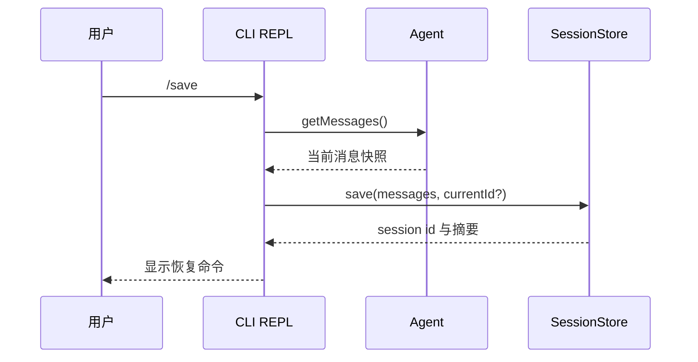
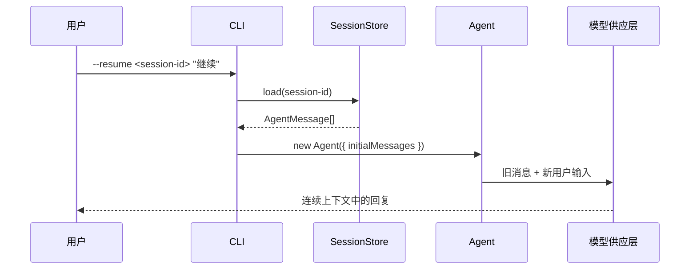

# Session 会话保存与恢复教学文档

## 解决的问题

在 Session 模块之前，mini-ccode 已能在一个 REPL 进程中连续对话：

```text
用户输入
  -> Agent 把消息追加到内存历史
  -> 下一轮请求携带历史
```

但程序退出后，内存历史会消失。用户不能保存正在进行的代码讨论，也不能在下一次启动时继续它。

本模块增加一条用户能够直接操作的路径：

```text
REPL /save
  -> 保存当前消息快照

REPL /sessions
  -> 查看当前工作区已保存的会话

启动 --resume <session-id>
  -> 载入旧消息
  -> 继续向模型提问
```

## 会话保存的边界

会话保存对象是对话消息，不是整个工作区状态。

| 保存内容 | 不保存内容 |
|---|---|
| 用户消息 | 修改前后的文件版本 |
| 模型回复 | Git 状态 |
| 工具调用及工具结果消息 | 尚未设计的上下文压缩状态 |
| 保存时间与所属工作区 | 旧会话的写入权限选择 |

这一区分很重要。恢复一次对话表示模型重新获得先前讨论上下文，不表示文件会被还原，也不表示新进程拥有先前的操作权限。

## 为什么采用显式保存

ccb 会持续写入会话记录（transcript），因此即使会话中途终止，也可以恢复到最近记录的位置。这种能力依赖更完整的状态模型：消息链、上下文压缩、文件历史、分支恢复等。

mini-ccode 当前选择由用户执行 `/save` 才写入磁盘：

| 方案 | 优点 | 当前阶段的取舍 |
|---|---|---|
| 每轮自动保存 | 更接近 ccb，中断恢复更强 | 会提前引入未设计的半完成轮次与状态一致性问题 |
| `/save` 显式快照 | 写入行为明确，用户立即可用 | 用户需要主动保存 |

首版的重点是把能力完整接到用户路径上，而不是先实现一个用户无法判断行为的后台记录系统。

## 数据流

### 保存当前会话



第一次保存会生成一个 UUID 格式的会话标识。同一 REPL 再次保存会覆盖同一份快照，因此用户得到的是“当前会话的最新保存点”，不是一串无意义的重复记录。

### 恢复会话



载入发生在创建 provider 之前。会话标识错误、记录不存在或文件损坏时，CLI 会直接报告错误，不会发起模型请求。

## 存储结构与项目隔离

默认目录为：

```text
~/.mini-ccode/projects/<workspace-key>/sessions/<session-id>.json
```

`workspace-key` 是规范化工作区路径的摘要值。它解决两类问题：

1. 不同项目的会话列表不会混在一起。
2. 工作区路径中的盘符、分隔符等字符不会直接进入目录名。

JSON 文件保存版本号、会话标识、规范化工作区路径、保存时间与完整消息数组。载入时会验证这些字段和消息结构；不符合合同的数据不会进入 Agent。

## 权限边界

用户直接输入 `/save`，表达的是“把当前对话记录保存到本地”。这不是模型请求执行的文件工具，因此 `/save` 本身不经过 File Tools 的权限策略。

模型恢复后能否修改工作区，则仍由本次启动的权限模式决定：

```text
bun run mini-ccode -- --resume <session-id>
  -> 默认 read-only，模型写文件仍被拒绝

bun run mini-ccode -- --permission-mode allow-all --resume <session-id>
  -> 用户本次明确允许后，模型才可修改文件
```

历史工具消息可以告诉模型“以前写过什么”，但不能替用户重新授权。

## 代码映射

| 文件 | 职责 |
|---|---|
| `src/session/types.ts` | 声明保存数据、摘要、错误与 `SessionStore` 接口 |
| `src/session/store.ts` | 实现项目隔离目录、UUID 校验、JSON 保存/载入及消息校验 |
| `src/cli/options.ts` | 解析 `--resume <session-id>` |
| `src/cli/input.ts` | 识别 `/save` 与 `/sessions` |
| `src/cli/run.ts` | 在 CLI 路径创建存储、恢复 Agent、处理保存与列表命令 |
| `tests/session.test.ts` | 验证存储合同和损坏记录处理 |
| `tests/cli-run.test.ts` | 验证保存、列表、恢复以及恢复后的权限行为 |

## 教学版取舍

| 层面 | ccb 做法 | mini-ccode 当前实现 | 后续接近方向 |
|---|---|---|---|
| 用户行为 | 默认持续保存，支持继续最近会话和恢复选择 | 用户执行 `/save`，以 `/sessions` 和 `--resume` 使用快照 | 增加自动保存与选择界面 |
| 存储边界 | 编排引擎持续写会话记录（transcript） | CLI 命令写 JSON 快照 | Agent/Session 状态成熟后接入持续记录 |
| 数据模型 | 支持分支、压缩、文件历史与额外会话状态 | 保存 `AgentMessage[]` 与基本元数据 | 随 Context、文件历史模块扩展版本化格式 |
| 权限恢复 | 完整会话状态体系可参与恢复 | 始终采用新启动命令的权限模式 | 未来即使保存规则，也要安全合并并允许用户覆盖 |

## 用户操作示例

```text
bun run mini-ccode
mini-ccode> 检查当前模块有哪些测试
...
mini-ccode> /save
Session saved: <session-id>
Resume with: bun run mini-ccode -- --resume <session-id>
```

稍后恢复：

```text
bun run mini-ccode -- --resume <session-id> "继续完善测试"
```

查看可恢复记录：

```text
mini-ccode> /sessions
Saved sessions:
  <session-id>  <saved-at>  检查当前模块有哪些测试
```

## 仍未覆盖的能力

- 未自动保存未显式执行 `/save` 的新消息。
- 未提供 `--continue` 最近会话入口或交互式会话选择器。
- 未保存文件修改快照、上下文压缩记录或任务状态。
- 未提供会话删除、重命名或分支功能。

这些能力应在其依赖模块具备明确合同后逐步加入，而不是把未完成语义混入首版会话快照。
