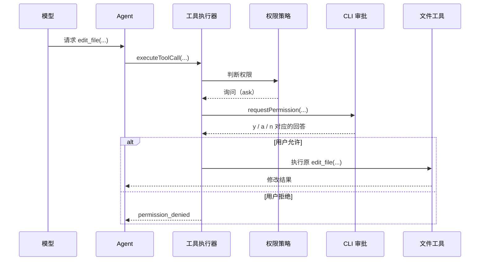

# 第 11 章：Interactive Permission Approval（交互式权限审批）

## 本章目标

读完本章，你应该能理解：

- 默认模式为什么需要在敏感操作前询问用户。
- `y`、`a`、`n` 三种回答如何影响工具执行。
- 为什么当前会话允许不应该写入 session。

## 1. 为什么需要审批

权限模块不能只回答“程序是否有能力执行工具”，还要把敏感操作的最终决定交给用户。

此前 mini-ccode 已能判断：

```text
读取文件 -> 允许
写入文件 -> 拒绝，或用户启动时选择全部允许
```

这两个极端都不适合作为日常编辑路径。用户通常希望模型可以提出修改，但在实际写盘前看到目标并决定是否接受。本模块补齐的就是中间状态：询问（`ask`）。

## 2. 用户现在能观察到什么

未指定 `--permission-mode` 时，CLI 使用默认（`default`）模式：

```powershell
bun run mini-ccode -- "修改 README 中的运行说明"
```

读取和搜索仍直接执行。模型请求 `write_file` 或 `edit_file` 时，CLI 会在执行前显示摘要：

```text
需要批准 edit_file：
  文件路径：README.md
  查找文本："old text"
  替换文本："new text"
  选择 a 后，本进程后续所有 edit_file 请求将直接执行。
是否允许？[y] 仅本次  [a] 当前会话允许此工具  [n] 拒绝
```

三种回答的含义是：

| 回答 | 结果 |
|---|---|
| `y` | 只执行当前这一次工具调用 |
| `a` | 执行当前调用，并在本进程内允许后续同名文件工具 |
| `n` | 拒绝当前调用，文件不改变 |

另外两个模式仍有明确用途：

| 模式 | 行为 |
|---|---|
| `--permission-mode read-only` | 非只读工具直接拒绝，不弹出询问 |
| `--permission-mode allow-all` | 已注册工具直接执行，不弹出询问 |

## 3. 最小结构

三级权限结果和用户回答不是同一件事：

```text
权限策略（PermissionPolicy）
  -> 允许（allow）：工具可立即执行
  -> 拒绝（deny）：工具不可执行
  -> 询问（ask）：必须等待用户回答

用户审批回答（PermissionApproval）
  -> 允许一次（once）
  -> 当前会话允许（session）
  -> 拒绝
```

策略负责识别“是否敏感”；CLI 负责显示信息和读取答案；工具不接触终端输入。这样同一个文件工具可以被 CLI、测试或未来其他界面复用。

## 4. 执行流程



关键点是用户批准后执行原工具调用。模型不需要重新生成参数，也没有机会在批准后悄悄替换操作内容。

## 5. 代码分层

| 文件 | 职责 |
|---|---|
| `src/permission/types.ts` | 定义审批回答和审批函数的公共类型 |
| `src/permission/policies.ts` | `interactivePermissionPolicy()` 对非只读工具返回询问结果 |
| `src/tools/execute.ts` | 收到询问后等待审批；无审批入口或审批失败时保守拒绝 |
| `src/agent/agent.ts` | 将审批函数传入工具执行上下文 |
| `src/cli/input-reader.ts` | 让 REPL 普通输入和运行中的审批回答共享输入通道 |
| `src/cli/permission.ts` | 显示文件操作摘要，处理 `y/a/n` 和进程内允许集合 |
| `src/cli/run.ts` | 创建权限运行状态并接入默认 Agent |

## 6. 当前会话允许为何不保存

用户输入 `a` 后，mini-ccode 仅在当前进程的集合中记录工具名。例如允许 `edit_file` 表示本进程后续所有 `edit_file` 请求直接执行，并不限于同一个文件，因此提示会明确说明作用范围。

`/save` 保存的是对话消息，不保存该集合；`--resume` 恢复旧对话时也不会恢复授权。历史消息可以说明之前发生过修改，但不能代表用户对本次进程继续开放修改能力。

## 7. 教学版取舍

| 层次 | ccb 做法 | mini-ccode 当前实现 | 教学版取舍 |
|---|---|---|---|
| 用户可见行为 | 工具专用审批界面和更丰富规则 | 文本 `y/a/n` 审批文件修改 | 没有统一审批入口 |
| 架构边界 | 权限规则、界面和设置来源协作 | 策略、CLI 审批、工具执行三层分开 | 工具直接执行 |
| 会话允许 | 可记录更具体的规则 | 文件工具按工具名在进程内允许 | 无 |
| 命令审批 | 可分析命令并提出规则 | 尚未实现命令工具 | 少量危险文本拦截 |

mini-ccode 没有提前复制 ccb 的命令规则或设置持久化，因为当前可观察目标是先让已有文件编辑在默认 CLI 路径中安全可用。第 12 章本地命令执行设计因此采用更窄的边界：默认模式下每条命令单独审批，不提供命令工具的当前会话允许。

## 8. 测试证明了什么

测试覆盖以下边界：

1. 默认策略对读取工具允许、对文件修改工具询问。
2. 工具执行器只在用户允许后执行，拒绝或审批故障时不执行。
3. Agent 会把允许后的工具结果或拒绝结果继续传给模型。
4. CLI 的默认模式支持拒绝、允许一次和当前会话允许。
5. `read-only` 与 `allow-all` 保持原有明确语义。
6. 保存并恢复对话不会恢复会话内授权。

因此这个模块的效果不是隐藏接口：用户已经能在默认 CLI 中直接审批真实文件修改。
