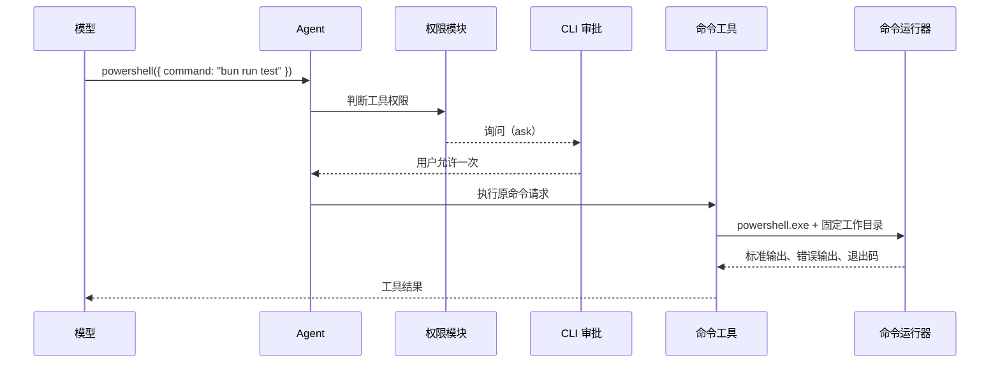

# 本地命令执行教学文档

## 1. 这个模块交付了什么

mini-ccode 现在可以让模型请求运行项目中的本地命令：

| 运行平台 | 给模型的工具 | 使用的命令解释器 |
|---|---|---|
| Windows | `powershell` | Windows PowerShell |
| macOS / Linux | `bash` | Bash |

当前工作环境是 Windows，因此用户可以在默认 CLI 路径中让模型提出 PowerShell 命令，例如运行测试。命令不会绕过权限模块（Permission）：默认模式中，实际创建子进程前必须先获得用户批准。

## 2. 为什么不是所有平台都叫 Bash

Bash 和 PowerShell 不是同一种命令语言：

```text
Bash:       ls src && grep -R "TODO" src
PowerShell: Get-ChildItem src; Select-String -Path src\* -Pattern "TODO"
```

如果 Windows 上把工具名写成 `bash`，执行时却偷偷交给 PowerShell，模型看到的合同与真实语法就不一致。因此本模块表达的是“本地命令执行”，并根据平台提供真实的解释器入口。

## 3. 用户可见权限行为

默认（`default`）模式中，文件工具和命令工具的授权范围不同：

| 工具类别 | 默认审批选项 | 原因 |
|---|---|---|
| `write_file` / `edit_file` | 允许一次、当前进程允许此工具、拒绝 | 工作区边界已存在，且界面明确披露按工具名放行范围 |
| `powershell` / `bash` | 允许一次、拒绝 | 当前没有可靠的命令规则，按工具名放行会允许任意后续命令 |

命令审批提示类似：

```text
需要批准 powershell：
  命令："bun run test"
  本地命令必须逐条批准，本次允许不会放行后续命令。
是否允许？[y] 仅本次  [n] 拒绝
```

命令文本会完整显示，不会像大段文件内容预览那样截断；否则用户可能在未看到命令末尾行为的情况下批准执行。

三种启动模式的实际含义是：

| 模式 | 本地命令行为 |
|---|---|
| `default` | 每条命令执行前询问，只能允许一次或拒绝 |
| `read-only` | 直接拒绝，不创建子进程 |
| `allow-all` | 直接执行，不显示审批提示 |

## 4. 执行链路



允许的是提示中展示的那次工具调用。下一条命令仍重新进入审批，不会因之前批准过 PowerShell 就直接执行。

## 5. 代码结构

| 文件 | 职责 |
|---|---|
| `src/command-tools/types.ts` | 定义解释器、运行请求、运行结果和可注入命令运行器 |
| `src/command-tools/runner.ts` | 使用指定解释器启动真实子进程 |
| `src/command-tools/create-tool.ts` | 参数检查、结果格式化、输出截断和工具定义 |
| `src/command-tools/index.ts` | 按当前平台选择 `powershell` 或 `bash` |
| `src/cli/run.ts` | 将命令工具注册进默认 Agent |
| `src/cli/permission.ts` | 显示命令摘要，并禁止命令工具使用当前会话允许 |

测试可以注入假的命令运行器（runner），因此不会为了验证权限而启动真实系统命令。

## 6. 输出合同

命令工具保留模型处理结果所需的信息：

```text
标准输出内容
[stderr]
错误输出内容
[exit code: 1]
```

规则如下：

| 情况 | 工具结果 |
|---|---|
| 成功且有输出 | 返回标准输出 |
| 有错误输出 | 增加 `[stderr]` 部分 |
| 退出码非零 | 增加 `[exit code: N]` |
| 无任何输出且成功 | 返回 `(no output)` |
| 超时 | 返回超时信息 |
| 长输出 | 保留开头和结尾，中间标明已截断 |

非零退出码通常表示测试失败、构建失败或命令自身报告问题，并不表示工具系统崩溃。

## 7. 教学版取舍

| 层次 | 生产级系统常见做法 | mini-ccode 当前实现 | 教学版取舍 |
|---|---|---|---|
| 平台入口 | Bash，并可提供 PowerShell | 当前平台只注册一个真实解释器工具 | 仅有 Bash 工具 |
| 默认命令权限 | 能结合命令分析和规则询问或允许 | 所有命令逐条询问 | 工具默认直接执行 |
| 会话放行 | 可生成更细规则 | 命令工具不提供会话放行 | 无统一权限审批 |
| 执行能力 | 后台任务、进度、大输出处理等 | 前台执行、超时、输出截断 | 简单前台执行与截断 |

mini-ccode 没有用字符串黑名单假装完成安全分析，也没有把 `git status` 自动当成安全命令。要进一步接近 生产级系统，需要单独设计能够理解命令结构和授权范围的规则层。

## 8. 测试覆盖

当前测试证明：

1. Windows 创建 `powershell`，其他平台创建 `bash`。
2. 命令运行请求使用固定工作目录、明确解释器和超时。
3. 空命令和非法超时不会进入运行器。
4. 输出、错误输出、退出码、超时和截断格式稳定。
5. 默认模式批准一次后执行命令，拒绝时不执行。
6. 命令工具输入 `a` 不会产生会话放行，也不会执行命令。
7. 连续两条命令会各自审批。
8. `read-only` 与 `allow-all` 会真实影响命令执行路径。
9. 较长命令在审批前完整显示，不隐藏末尾内容。

因此，本模块的效果可以直接通过 CLI 观察：模型已经能够提出并在用户明确批准后运行本地命令。
