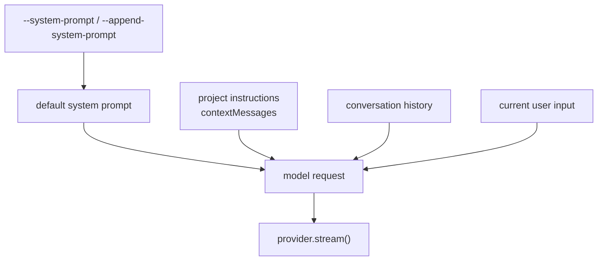

# 第 14 章：System Prompt / Instructions（系统提示词）

## 本章目标

读完本章，你应该能理解：

- 系统提示词如何约束 Agent 的默认行为。
- 项目规则上下文为什么不应该混入普通对话历史。
- 为什么提示词必须和真实可用能力保持一致。

## 提示词组装图

一次模型请求由多层内容组成。系统提示词是最高层规则；项目规则是额外上下文；普通历史才是可保存、可恢复的对话内容。



## 1. 它解决什么问题

系统提示词（system prompt）是模型每次请求前收到的最高层行为说明。没有它，模型只看到用户输入、历史消息和工具定义，不知道 mini-ccode 期望它按什么工程习惯工作。

本模块把三类内容分开：

| 层 | 内容 | 是否进入普通历史 |
|---|---|---:|
| 系统提示词 | mini-ccode 的通用行为规则 | 否 |
| 项目规则上下文 | 当前工作区的项目规则文件 | 否 |
| 普通对话历史 | 用户输入、模型回复、工具结果 | 是 |

这个分层接近 ccb 的做法：默认 system prompt 负责通用行为，项目规则通过额外上下文进入模型请求。mini-ccode 教学版保留这条边界，但公开教程只讨论机制，不要求读者公开自己的本地规则文件。

## 2. 默认提示词

默认提示词在 `src/instructions/default-prompt.ts` 生成，结构学习 ccb 的段落组织，但只描述当前已经实现的能力：

```text
# Identity
# Environment
# System
# Doing Tasks
# Using Tools
# Reporting
```

它包含工作目录、日期、平台、权限模式和当前注册工具列表。比如 CLI 默认注册 File Tools 和本地命令工具，提示词就会列出这些工具名称和描述。

它不会写 Skills、MCP、Slash Commands 或 GitHub/PR 工作流，因为这些模块当前还不是用户可用路径。Sub-Agent 已经接入默认 CLI，因此默认提示词会包含何时使用 `agent` 工具的规则。提示词不能提前声明用户用不到的能力，也不能漏掉已经接入的关键能力。

## 3. 项目规则上下文

`src/instructions/project.ts` 只读取工作区根目录的项目规则文件。如果文件不存在，返回 `undefined`；如果文件存在但读取失败，则报错并阻止 CLI 静默启动。

读取到的项目规则会变成一条前置用户消息：

```text
<project-instructions>
Source: project instructions
Path: ...

...
</project-instructions>
```

这条消息会放在真实用户输入之前，但不会写入 `Agent.getMessages()`，也不会被 Session 保存成普通历史。

## 4. 替换和追加

CLI 支持两个入口：

```bash
bun run mini-ccode --system-prompt "Custom agent." "review"
bun run mini-ccode --append-system-prompt "Only report findings." "review"
```

`--system-prompt` 替换默认系统提示词。这和 ccb 的 custom system prompt 语义一致：替换的是默认通用行为规则，不是删除所有上下文。

`--append-system-prompt` 追加到当前系统提示词末尾。普通用户通常更适合用追加，因为它保留 mini-ccode 默认行为，只补充本次启动的临时要求。

## 5. Agent 如何接收

`AgentOptions` 现在有两个不同入口：

```ts
systemPrompt?: string;
contextMessages?: readonly AgentMessage[];
```

请求 provider 时顺序是：

```text
system prompt
project context messages
conversation history
current user input
```

这样做有两个好处：

1. Session 保存和恢复只处理普通历史，不污染项目规则。
2. Context 压缩时仍能把前置上下文纳入估算和摘要请求，不会丢掉项目约束。

## 6. 教学版取舍

| 维度 | ccb 做法 | mini-ccode 当前 |
|---|---|---|
| 默认提示词 | 多段动态数组，带提示词缓存边界 | 一个可读字符串，段落结构接近 ccb |
| 项目规则 | 多级项目规则、rules、include | 工作区根项目规则文件 |
| 用户入口 | 替换、追加、文件参数、stdin | 替换和追加文本参数 |
| 缓存 | provider 级 prompt cache | 不实现 |
| 动态上下文 | git、memory、MCP、language 等 | 工作目录、日期、工具、权限 |

当前简化的原因是教学版要先保证用户能看到真实效果：默认 CLI 请求已经带 system prompt，项目规则文件已经进入模型上下文，替换和追加参数也能直接影响请求。

## 7. 维护要求

系统提示词必须跟真实能力同步。以后如果工具、权限模式、CLI 流程、Context、Session、项目规则加载、Skills、MCP、Git 状态上下文或 GitHub/PR 工作流改变了用户可见行为，就要检查默认提示词、教学文档和测试是否也要改。

如果提示词描述了用户当前用不到的能力，就是实现和说明不一致，应当视为回归。
