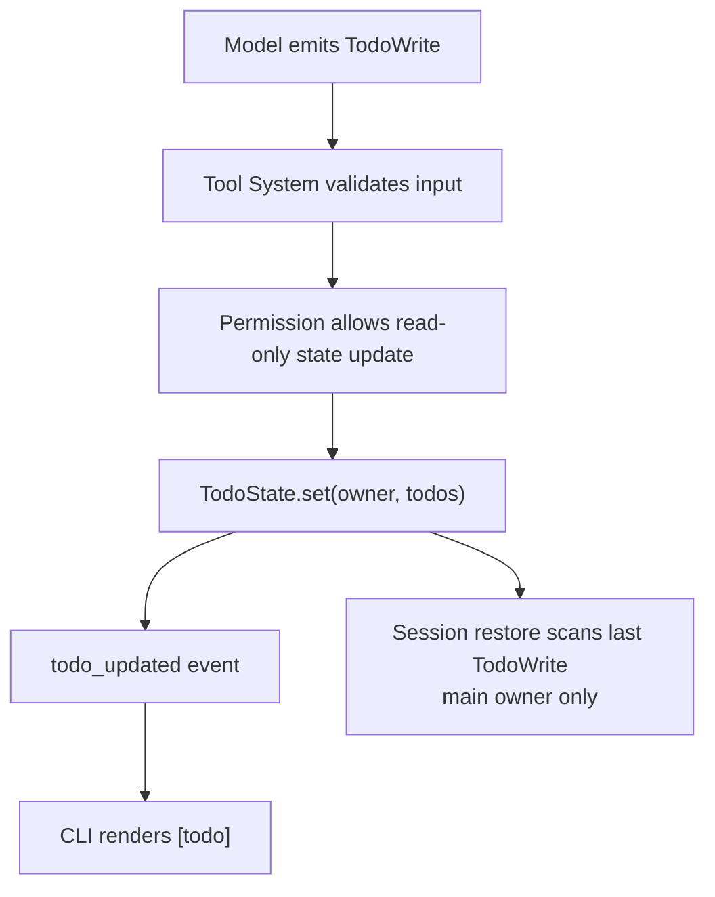

# 第 15 章：Todo（任务清单）

## 本章目标

读完本章，你应该能理解：

- Todo 为什么是 Agent 的进度状态，而不是用户界面装饰。
- 模型如何通过工具调用维护任务清单。
- 父 Agent 和子 Agent 为什么需要不同的 Todo 分区。

## Todo 状态流图

TodoWrite 是一个工具调用。模型不能直接改 UI 状态，只能通过工具系统提交完整任务列表。



## 1. 它解决什么问题

Todo 任务清单是当前会话里的短期进度表。它让模型在处理复杂任务时，把“要做什么、正在做什么、做完了什么”写成结构化状态，并让 CLI 直接显示给用户。

它不是后台任务系统，也不是项目管理数据库。第一版只服务当前 Agent 会话。

## 2. 最小模型

Todo 的核心数据结构很小：

```ts
type TodoItem = {
  content: string;
  activeForm: string;
  status: "pending" | "in_progress" | "completed";
};
```

`content` 是任务本身，例如“运行测试”。`activeForm` 是进行中描述，例如“正在运行测试”。当前 CLI 先显示 `content`，保留 `activeForm` 是为了后续 spinner 或更完整 REPL UI 使用。

## 3. 工具路径

模型不能直接改 Agent 内部状态，它通过工具调用更新：

```text
模型输出 TodoWrite tool call
  -> Tool System 校验输入
  -> Permission 链路放行只读工具
  -> TodoWrite 更新 TodoState
  -> Agent 发出 todo_updated 事件
  -> CLI 渲染 [todo] 清单
```

这条路径很重要：Todo 虽然不会写文件，但仍然是一个真实工具。它不绕过工具系统，也不绕过权限执行链。

## 4. 为什么权限直接允许

`TodoWrite` 只修改当前进程内的会话状态，不写项目文件，不运行本地命令，也不影响外部系统。因此它标记为只读工具，并且在默认、只读、全部允许三种权限模式下都可以执行。

这和 ccb 的轻量 Todo 一致：Todo 是进度状态，不是危险操作。

## 5. CLI 如何显示

当模型调用：

```ts
TodoWrite({
  todos: [
    {
      content: "Run tests",
      activeForm: "Running tests",
      status: "in_progress"
    }
  ]
})
```

CLI 会显示：

```text
[todo]
  - in_progress: Run tests
```

如果传入的所有任务都已经 `completed`，Agent 会把当前清单清空，CLI 显示：

```text
[todo] all tasks completed
```

这样终端不会长期挂着已经完成的旧清单。

## 6. 会话恢复

第一版不新增 Todo 文件，也不改变 Session 格式。保存会话时，普通消息历史里已经包含 assistant 的 `TodoWrite` 工具调用。

恢复时，mini-ccode 从后往前扫描历史消息：

```text
找到最后一次 assistant.toolCalls[name == "TodoWrite"]
读取 input.todos
校验结构
恢复为当前 TodoState
```

如果历史里的 Todo 结构不合法，就忽略并恢复为空清单。

## 7. 教学版取舍

| 层 | ccb 做法 | mini-ccode 当前 |
|---|---|---|
| 工具 | `TodoWrite` | `TodoWrite` |
| 状态 | `AppState.todos[agentId]` | `TodoState` 按 owner 分区：`main` 和 `subagent:<slug>` |
| 展示 | React/Ink UI 或任务列表视图 | CLI 文本 `[todo]` |
| 恢复 | 从 transcript 扫描最后一次 TodoWrite | 当前只从父 Agent Session 消息恢复 `main` |
| 提醒 | 有附件提醒模型更新 Todo | 暂不实现 |
| 后台任务 | 另有更重的 Task 系统 | 暂不实现 |

mini-ccode 先实现最短可见路径：模型能调用，用户能看到，父 Agent Session 能恢复。Sub-Agent 加入后，Todo 已经按 owner 分区，避免子 Agent 的 `TodoWrite` 覆盖父 Agent 的计划；子 Agent 自己的历史和 Todo 第一版仍不持久化。

## 8. 什么时候应该用 Todo

默认系统提示词现在会在 `TodoWrite` 可用时提醒模型：

- 复杂、多步骤或用户明确要求跟踪进度的任务，应该用 Todo。
- 开始和完成任务时及时更新状态。
- 简单单步任务或纯问答不需要 Todo。

这避免 Todo 变成噪声，也避免长任务没有可见进度。
