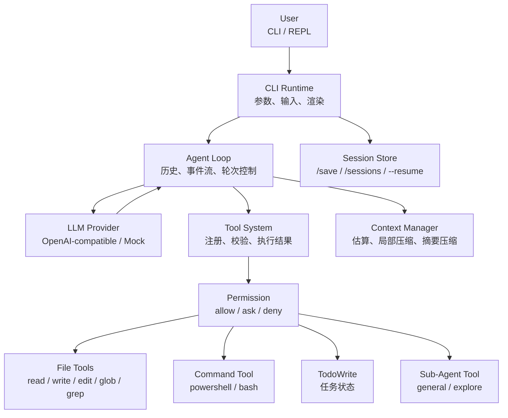

# Mini CCode 教程

这组文档按功能加入项目的顺序组织，目标是让读者理解一个小型编程 Agent 如何从空项目逐步长成可运行的 CLI 工具。

每章都尽量遵循同一条讲解线：

```text
问题 -> 最小模型 -> 本项目实现 -> 与 ccb 的差异 -> 代码导读 -> 常见误区
```

这里的 ccb 是一个更完整的编程 Agent 实现，用来作为公开对比对象。mini-ccode 不追求一步到位复制完整产品，而是把能力拆成可以观察、可以测试、可以解释的教学步骤。

## 总体架构

mini-ccode 的主线可以先看成四层：用户入口、Agent 循环、工具执行、状态管理。模型不直接读写文件，也不直接运行命令；它只能发出结构化工具调用，再由 Tool System 和 Permission 统一处理。



这张图也是后续章节的阅读地图：第 02-04 章解释模型和 Agent 主循环，第 05-12 章解释工具与权限，第 13-17 章解释上下文、提示词、Todo 和 Sub-Agent。

## 推荐阅读顺序

| 章节 | 主题 | 读完后应该理解 |
|---|---|---|
| [第 01 章：项目骨架](./01-project-skeleton.md) | 工程入口、脚本、测试和文档结构 | 为什么先建骨架而不是直接写 Agent |
| [第 02 章：模型供应商层](./02-llm-provider.md) | OpenAI-compatible 调用和流式事件 | 为什么要把模型 API 包成稳定接口 |
| [第 03 章：Agent 循环](./03-agent-loop.md) | 消息历史和事件流 | Agent Loop 和一次普通请求有什么不同 |
| [第 04 章：CLI / REPL](./04-cli-repl.md) | 命令行入口和交互循环 | 用户输入如何进入 Agent |
| [第 05 章：工具系统](./05-tool-system.md) | 工具定义、校验和执行 | 模型如何请求程序执行动作 |
| [第 06 章：权限系统](./06-permission.md) | allow / deny / ask 决策 | 为什么工具不能绕过权限层 |
| [第 07 章：模型工具调用](./07-provider-tool-calls.md) | provider tool calls 协议 | 模型工具调用如何进入 Agent Loop |
| [第 08 章：文件工具](./08-file-tools.md) | 读取、写入、编辑、搜索 | 编程 Agent 如何接触真实仓库 |
| [第 09 章：CLI 权限模式](./09-cli-permission-mode.md) | read-only / allow-all 启动模式 | 用户如何在入口处选择权限边界 |
| [第 10 章：会话保存](./10-session.md) | `/save`、`/sessions`、`--resume` | 对话历史如何跨进程恢复 |
| [第 11 章：交互式审批](./11-interactive-permission-approval.md) | 默认模式下的逐次询问 | 写文件前如何让用户参与决策 |
| [第 12 章：本地命令执行](./12-bash.md) | bash / powershell 工具 | 命令副作用为什么必须审批 |
| [第 13 章：上下文整理](./13-context.md) | 估算、局部压缩、摘要压缩 | 为什么不能无限追加历史 |
| [第 14 章：系统提示词](./14-system-prompt-instructions.md) | 默认提示词和项目规则上下文 | 提示词如何保持和真实能力一致 |
| [第 15 章：Todo 任务清单](./15-todo.md) | 任务状态工具 | Agent 如何显式维护工作进度 |
| [第 16 章：命令前缀审批](./16-command-prefix-permission.md) | prefix 级命令放行 | 为什么允许 `bun run` 比允许整个 shell 更窄 |
| [第 17 章：Sub-Agent](./17-sub-agent.md) | 普通子 Agent 和探索子 Agent | 父 Agent 如何把独立任务交给子 Agent |

## 阅读方式

建议先从第 01 章读到第 08 章，因为这部分建立了最小可用 Agent：模型、循环、工具、权限和文件能力。第 09 章以后是把这个 Agent 变得更像真实工具：会话、审批、命令、上下文、提示词、Todo 和 Sub-Agent。

如果只想快速理解整体架构，可以先读第 03、05、06、08、13、17 章。
